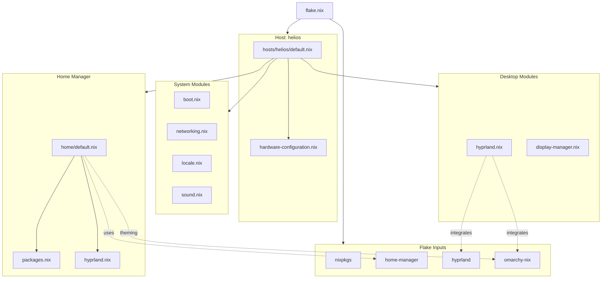

# NixOS Flake Project Structure

## Directory Tree

```
nix-config/
│
├── flake.nix                    # Main flake configuration
├── flake.lock                   # Dependency lock file
├── ARCHITECTURE.md              # Architecture documentation
├── STRUCTURE.md                 # This file
├── MIGRATION.md                 # Step-by-step migration guide
│
├── hardware-configuration.nix   # Generated hardware config (preserved)
│
├── hosts/                       # Host-specific configurations
│   └── helios/
│       ├── default.nix          # Main host configuration
│       └── hardware.nix         # Symlink to ../../hardware-configuration.nix
│
├── modules/                     # Reusable NixOS modules
│   ├── system/                  # System-level configurations
│   │   ├── boot.nix            # Bootloader settings
│   │   ├── networking.nix       # Network configuration
│   │   ├── locale.nix          # Locale and timezone
│   │   └── sound.nix           # Audio (PipeWire)
│   │
│   └── desktop/                 # Desktop environment
│       ├── hyprland.nix        # Hyprland WM configuration
│       └── display-manager.nix  # SDDM configuration
│
└── home/                        # Home-manager configurations
    └── emmetdelaney/
        ├── default.nix          # Main home config
        ├── packages.nix         # User packages
        └── hyprland.nix         # User Hyprland settings
```

## Architecture Diagram



## Component Relationships

### Flake Level
- **flake.nix**: Entry point that defines all inputs and outputs
- **Inputs**: External dependencies (nixpkgs, home-manager, hyprland, omarchy-nix)
- **Outputs**: NixOS configuration for host "helios"

### Host Level (hosts/helios/)
- **default.nix**: Aggregates all system and user configurations
- **hardware.nix**: Hardware-specific settings (CPU, storage, boot)

### Module Level
- **System Modules**: Core OS functionality independent of desktop
- **Desktop Modules**: Display manager and window manager configuration
- **Home Modules**: User-specific settings and packages

### Integration Points

#### Hyprland Integration
```
flake.nix (hyprland input)
    ↓
modules/desktop/hyprland.nix (system-level)
    ↓
home/emmetdelaney/hyprland.nix (user-level)
```

#### Omarchy Integration
```
flake.nix (omarchy-nix input)
    ↓
modules/desktop/hyprland.nix (apply system theme)
    ↓
home/emmetdelaney/default.nix (user theming)
```

#### Home-Manager Integration
```
flake.nix (home-manager input)
    ↓
hosts/helios/default.nix (enable home-manager)
    ↓
home/emmetdelaney/default.nix (user configuration)
```

## File Responsibilities

### flake.nix
**Purpose**: Main entry point for the entire configuration  
**Responsibilities**:
- Define all flake inputs with versions
- Configure nixosConfigurations for each host
- Set up home-manager integration
- Pass special arguments to modules

**Key Sections**:
```nix
inputs { ... }           # External dependencies
outputs { ... }          # Build configurations
nixosConfigurations      # Host definitions
```

### hosts/helios/default.nix
**Purpose**: Host-specific configuration aggregator  
**Responsibilities**:
- Import hardware configuration
- Import system modules
- Import desktop modules
- Configure home-manager for users
- Set system.stateVersion

**Imports**:
- `./hardware.nix`
- All system modules
- All desktop modules
- Home-manager NixOS module

### modules/system/boot.nix
**Purpose**: Bootloader configuration  
**Preserves**:
- systemd-boot enabled
- EFI variables access
- No custom settings needed

### modules/system/networking.nix
**Purpose**: Network configuration  
**Preserves**:
- Hostname: helios
- NetworkManager enabled
- Experimental features for flakes
- User in networkmanager group

### modules/system/locale.nix
**Purpose**: Localization settings  
**Preserves**:
- Default locale: en_GB.UTF-8
- Irish regional formats
- Europe/Dublin timezone
- GB keyboard layout

### modules/system/sound.nix
**Purpose**: Audio subsystem  
**Preserves**:
- PipeWire as main audio server
- PulseAudio compatibility
- ALSA support with 32-bit
- rtkit for real-time audio

### modules/desktop/hyprland.nix
**Purpose**: Hyprland window manager setup  
**New Configuration**:
- Enable Hyprland program
- XWayland support
- Essential Wayland packages
- Polkit authentication
- Integration with omarchy-nix theme

### modules/desktop/display-manager.nix
**Purpose**: Login screen configuration  
**Changes from GNOME**:
- Replace GDM with SDDM
- Configure for Wayland sessions
- Theme to match omarchy aesthetic

### home/emmetdelaney/default.nix
**Purpose**: User home-manager configuration  
**Responsibilities**:
- Import user packages
- Import Hyprland user config
- Apply omarchy user theming
- Set home.stateVersion

### home/emmetdelaney/packages.nix
**Purpose**: User package management  
**Preserves**:
- vim, wget, git
- code-cursor, zed-editor, vscode-fhs
- firefox

**Adds**:
- Terminal emulator
- File manager
- Application launcher
- Other tools required by omarchy

### home/emmetdelaney/hyprland.nix
**Purpose**: User Hyprland settings  
**Configuration**:
- Keybindings
- Window rules
- Workspace layout
- Monitor configuration
- Startup applications

## Data Flow

### System Boot
```
1. systemd-boot loads NixOS
2. NixOS applies system configuration from flake
3. System modules configure base OS
4. Desktop modules start Wayland/Hyprland
5. SDDM displays login screen
6. User logs in, triggers home-manager
7. Home-manager applies user configuration
8. Omarchy theming is applied
9. Hyprland starts with user config
```

### Configuration Rebuild
```
1. User modifies configuration files
2. Run: sudo nixos-rebuild switch --flake .#helios
3. Nix evaluates flake.nix
4. Nix locks dependencies if needed
5. Nix builds new system configuration
6. Nix activates new configuration
7. System services restart if needed
8. User can log out/in for full effect
```

## Module Import Chain

```
flake.nix
 └── nixosConfigurations.helios
      └── hosts/helios/default.nix
           ├── ./hardware.nix
           ├── modules/system/boot.nix
           ├── modules/system/networking.nix
           ├── modules/system/locale.nix
           ├── modules/system/sound.nix
           ├── modules/desktop/hyprland.nix
           ├── modules/desktop/display-manager.nix
           └── home-manager.nixosModules.home-manager
                └── home/emmetdelaney/default.nix
                     ├── packages.nix
                     └── hyprland.nix
```

## Customization Points

Users can customize at multiple levels:

1. **Host Level** (`hosts/helios/default.nix`)
   - Enable/disable module imports
   - Override module settings
   - Add host-specific packages

2. **Module Level** (`modules/*/`)
   - Modify system-wide settings
   - Change desktop configuration
   - Adjust hardware settings

3. **User Level** (`home/emmetdelaney/`)
   - Personal package selection
   - Hyprland keybindings
   - Application preferences
   - Theme customization

## Benefits of This Structure

### Separation of Concerns
- System vs Desktop vs User clearly separated
- Easy to understand what each file does
- Changes are localized to relevant files

### Reusability
- Modules can be reused across hosts
- Easy to add new hosts
- Share configurations between users

### Maintainability
- Small, focused files
- Clear dependencies
- Easy to debug issues
- Simple to add/remove features

### Version Control
- Meaningful git commits per module
- Easy to track changes
- Simple to revert specific changes
- Clear history of modifications